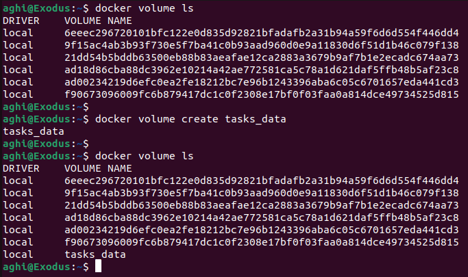
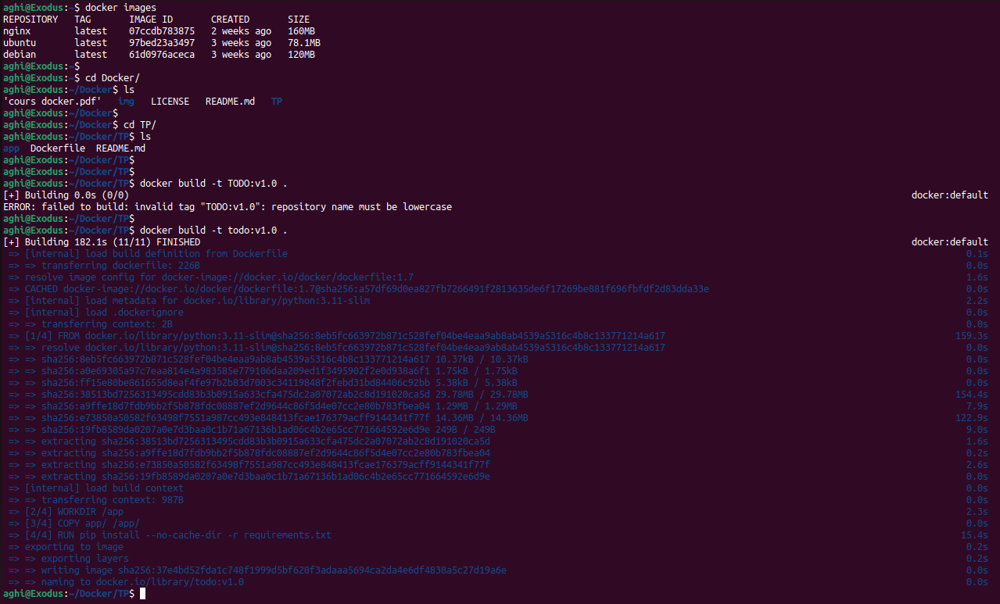
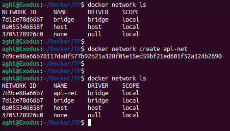
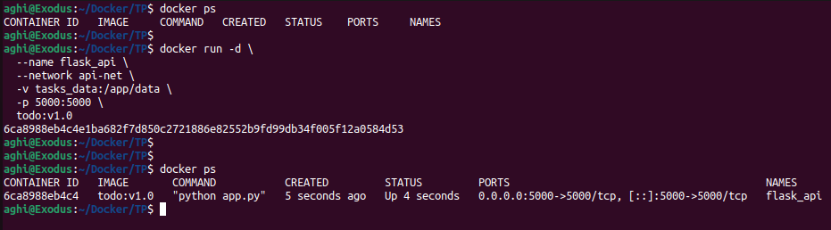
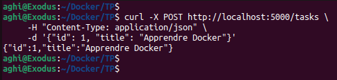
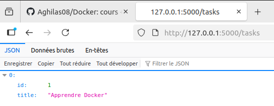
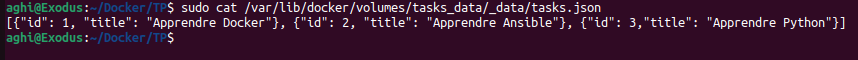
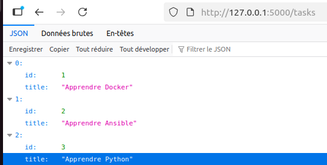

# TP complet sur Docker autour d’une API Flask

### Objectif du TP

* Créer une API Flask qui :
  * Permet de gérer **une liste de tâches** (“to-do list”)
  * Est conteneurisée avec un **Dockerfile**
  * Utilise **un volume Docker** pour persister les données

### Structure du projet
````
TP/
│
├── app/
│   ├── app.py
│   ├── requirements.txt
│   └── data/                
│
├── Dockerfile     
└── README.md

````

### Étape 1 : Créer l'API Flask
````python
from flask import Flask, jsonify, request
import os, json

app = Flask(__name__)

DATA_FILE = os.path.join(os.path.dirname(__file__), "data", "tasks.json")

## charger toutes les taches
def load_tasks():
    if not os.path.exists(DATA_FILE):
        return []
    with open(DATA_FILE, "r") as f:
        return json.load(f)

## Sauvegarder les tâches
def save_tasks(tasks):
    with open(DATA_FILE, "w") as f:
        json.dump(tasks, f)

@app.route("/tasks", methods=["GET"])
def get_tasks():
    return jsonify(load_tasks())

@app.route("/tasks", methods=["POST"])
def add_task():
    tasks = load_tasks()
    new_task = request.json
    tasks.append(new_task)
    save_tasks(tasks)
    return jsonify(new_task), 201

if __name__ == "__main__":
    os.makedirs(os.path.dirname(DATA_FILE), exist_ok=True)
    app.run(host="0.0.0.0", port=5000)

````
Ce code met en place une API avec **le framework Flask**. Elle permet de gérer **une liste de taches** stockés dans **un fichier JSON local**. Lorsqu’on lance l’app, elle crée automatiquement le dossier de données et écoute sur **le port 5000**, accessible depuis n’importe quelle machine du réseau. L’API propose deux routes principales : une route ``GET`` **/tasks** pour récupérer la liste complète des taches, et une route ``POST ``**/tasks** pour en ajouter de nouvelle. Les fonctions internes du code permettent de lire et d’enregistrer les données dans le fichier JSON, assurant ainsi une persistance simple des informations sans base de données.

### Étape 2 : Création du Dockerfile

````Dockerfile
# syntax=docker/dockerfile:1.7
# escape=\

FROM python:3.11-slim

WORKDIR /app

COPY app/ /app/

RUN pip install --no-cache-dir -r requirements.txt

EXPOSE 5000

CMD ["python", "app.py"]

````

### Étape 3 : Utiliser un volume Docker
Le volume servira a sauvegarder les donnés JSON des taches.
````shell
# Créer un volume pour les données
docker volume create tasks_data
````



### Etape 4 :  Construire l’image
````shell
docker build -t flask-api:1.0 .
````



### Etape 5 : Créer un réseau Docker
````shell
docker network create api-net
````




### Etape 6 : Lancer le conteneur
````shell
docker run -d \
  --name flask_api \
  --network api-net \
  -v tasks_data:/app/data \
  -p 5000:5000 \
  todo:v1.0
````


### Etape 7 : ajouter des taches
````shell
curl -X POST http://localhost:5000/tasks \
     -H "Content-Type: application/json" \
     -d '{"id": 1, "title": "Apprendre Docker"}'
````






